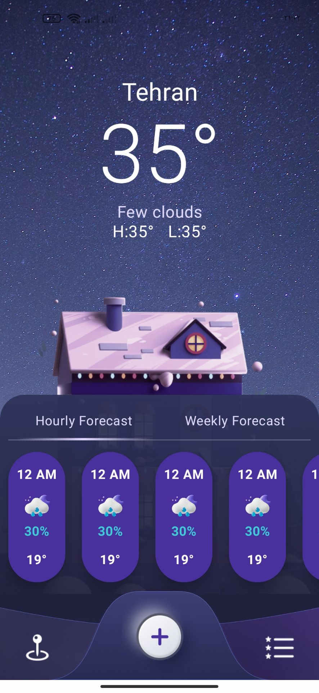
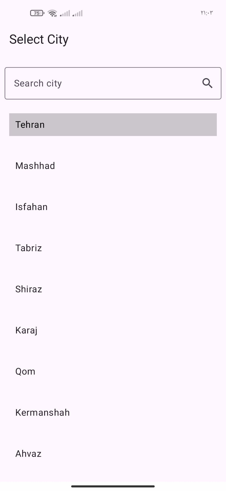
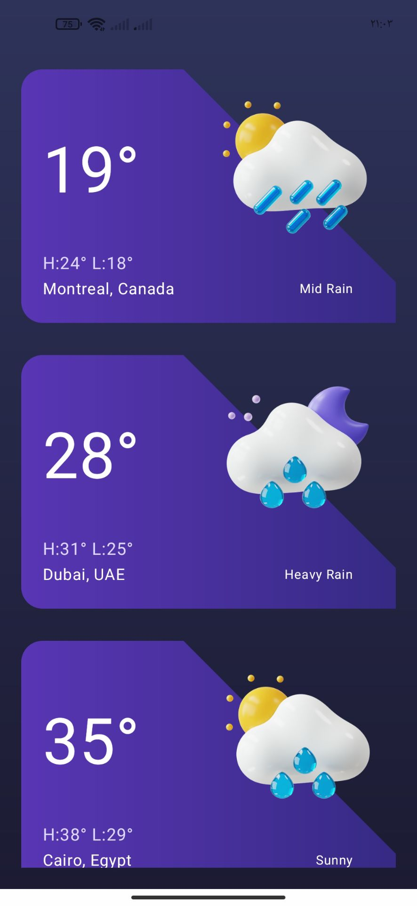
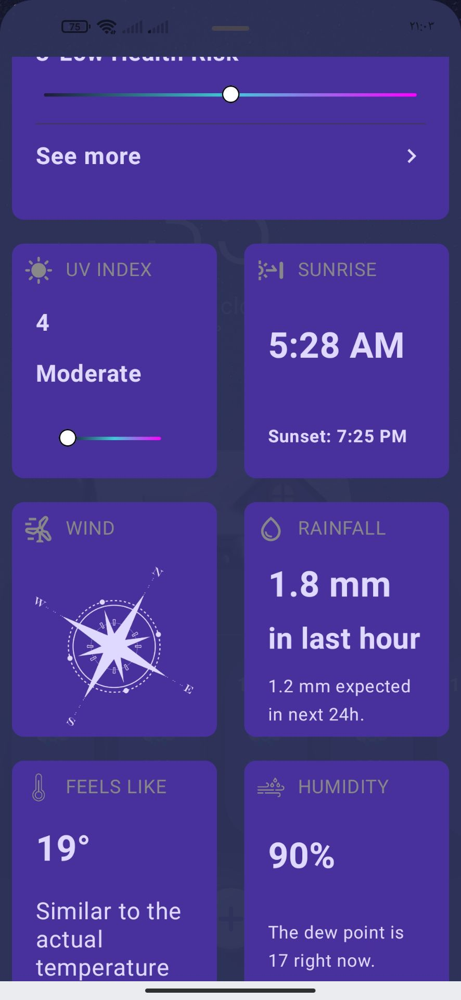

# 🌤️ WeatherApp  
**Platform:** Jetpack Compose  
**Architecture:** MVVM + Clean Architecture  
**License:** MIT  
---


WeatherApp is a modern and elegant real-time weather application built using Jetpack Compose and MVVM architecture. It allows users to search and view the current weather of any city with a smooth and responsive UI.

---

## ✨ Features

📍 View current weather by entering city name  
🌡️ Temperature, humidity, pressure, wind speed & cloud coverage  
🔄 Swipe to refresh weather data  
📱 Jetpack Compose UI with beautiful and responsive design  
📦 Clean MVVM architecture and modular structure  

---

## 🧱 Prerequisites

Make sure the following tools are installed before building the project:

- **Android Studio Hedgehog** (or newer)  
- **JDK 11**  
- **Gradle 8.1.4+**  
- **Kotlin 2.2.0+**  
- **AGP 8.1.1+**  
- **Minimum SDK:** 30  
- **Compile SDK:** 34  
- **Target SDK:** 34  

---

## 🔧 Used Technologies & Libraries

- **Jetpack Compose** – Declarative UI  
- **MVVM Architecture** – Clean and testable structure  
- **Hilt** – Dependency Injection  
- **Retrofit** – Networking  
- **Gson** – JSON parsing  
- **Coroutines** – Async operations  
- **Navigation-Compose** – In-app navigation  
- **Coil** – Image loading for weather icons  

---

## Screenshots

<div align="center">

<table>
  <tr>
    <td align="center">
      <br/>
      <sub><b>Note Screen</b>
    </td>
    <td width="30"></td>
    <td align="center">
      <br/>
      <sub><b>Task Screen</b>
    </td>
  </tr>
  
  <tr>
    <td align="center">
      <br/>
      <sub><b>Weather</b>
    </td>
    <td></td>
    <td align="center">
      <br/>
      <sub><b>More</b>
    </td>
  </tr>
</table>

</div>

---

## 🚀 Getting Started

Clone the repository:

```bash
git clone https://github.com/AliAyali/weather.git
```

**Name:** Ali Ayali  
**GitHub:** [github.com/AliAyali](https://github.com/AliAyali)  

## License
This project is licensed under the MIT License. See the [LICENSE](LICENSE) file for details.